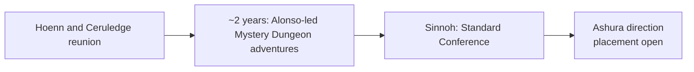

# Arcs 10–11 — Alonso's Adventurer Interval

**Status:** drafting

After Hoenn and Ceruledge's reunion, Amber spends approximately two years travelling with Alonso through Mystery Dungeons. This is a full growth phase, not a time skip or empty recovery period. It earns the competence that later makes her Sinnoh Conference performance and Mega use credible.

## Structural Job

The interval gives Amber room to mature as an explorer and teammate outside a badge race. Alonso is a companion and co-adventurer here, not a subordinate or a temporary guide who vanishes once he has introduced a Dungeon.

## Durable Direction

- Amber and Alonso explore multiple Mystery Dungeons, encounter deeper Dungeon lore, and face one or more legendary-scale incidents.
- The individual expeditions, their order, and their resolutions remain open. Do not invent an episode list merely to fill the two years.
- Amber develops a mature rotating roster through field experience. The working emotional core is Ditto, Ursaring, Flygon, Vee, Gardevoir, and Ceruledge; it is a planning direction, not a locked final-six declaration.
- Butterfree and Heracross remain meaningful rotations. Amber searches Mystery Dungeons for Heracross's Mega Stone; Heracross's precise, repeatable physical long-range style is a live team direction.
- Amber commonly keeps one active-carry slot available for a possible capture and uses Caterpie/Butterfree as capture support. Ownership can exceed the active carry limit through lawful transfers and stabling.
- The interval is the principal explanation for Amber's later team-wide experience, earned Mega competence, and ability to compete with Tobias rather than an unexplained power jump.

## Open Boundaries

- Exact start/end dates and the exact age at Sinnoh; the approximate two-year duration is settled, while the full age/arc ledger must be recalculated from it.
- Which legendary-scale incidents occur, who joins temporarily, and which Pokemon are with Amber in each expedition.
- Where Ashura first enters this sequence. It must not be placed by treating the retired one-year jump as current.
- Pikachu's origin: a dangerous Mystery Dungeon origin is a possibility, not canon.

## Cross-Refs

- [Saga overview](../../saga-overview.md)
- [Mystery Dungeon instability](../../saga-threads/mystery-dungeon-instability.md)
- [Alonso Quijano](../../../reference/characters/humans/alonso-quijano.md)
- [Amber's team](../../rosters/amber-team.md)
- [Sinnoh](../12-sinnoh/overview.md)
