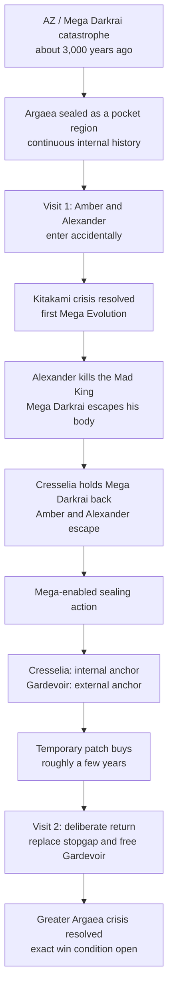

# Argaea

**Status:** drafting

**Arcs:** 10 (Visit 1) and 16 (Visit 2)

Argaea's cross-arc thread is a failed first encounter that leaves Cresselia and
Gardevoir holding a temporary seal, followed by a deliberate return to replace
that stopgap and end the larger Mega Darkrai crisis. The two visits are the
current architecture; the mechanics that connect them are still being designed.

## Causal Spine --- Decided / Current Direction

- Argaea is part of the same Pokemon world, not an alternate world. It is a
  physically and dimensionally sealed pocket region: smallish on a regional
  scale, but large enough for distinct provinces and communities.
- The AZ / Mega Darkrai catastrophe sealed it about 3,000 years ago. Its
  inhabitants then experienced continuous history; Argaea's cultures and
  politics developed apart from the ordinary Pokemon world.
- Kitakami is one province or community within Argaea. References to places or
  people "outside Kitakami" can mean elsewhere in Argaea, so Ogerpon and her
  human companion need not have crossed Argaea's outer barrier.
- Mew has no role in Argaea's barrier, seal, or Amber's access. Amber's trace Mew
  DNA is not a key.
- The story uses two Argaea visits, not three.

Argaea later contributes sealed-space experience to Amber's wider exploration
and navigation throughline. That structural convergence does not make Argaea a
Mystery Dungeon, alternate universe, Ultra Wormhole, or universal source of
dimensional anomalies.

## Visit Structure --- Decided / Current Direction

### Visit 1 --- Accidental Entry

Amber and Prince Alexander enter Argaea together without planning to do so.
The visit has two stages:

1. **Kitakami crisis.** Over several days they deal with and resolve the
   immediate Ogerpon / Loyal Three mystery or crisis. During this stage Amber
   and Gardevoir discover, or are forced to discover, Mega Evolution together.
2. **Larger threat.** After the local resolution, Alexander kills his father,
   the Mad King, because the King has gone mad or corrupt and must be stopped.
   At the moment of death, Mega Darkrai visibly tears free from the King's body.
   Amber and Alexander are still forced to retreat.

Cresselia catastrophically exhausts and injures herself while blocking or
holding back Mega Darkrai long enough for Amber and Alexander to escape the
sealed realm. This is sacrifice through injury and entrapment, not established
death: Cresselia remains on the inner side of the seal and continues holding
it. The exact interception, retreat route, and escape mechanics remain open.

At the author level, the being that escapes the King is specifically **Mega
Darkrai**. Amber has never seen this form and does not know it exists, so her
immediate POV cannot identify it by that name. Her description and mistaken or
partial interpretation remain open.

Cresselia can no longer carry the barrier alone. She instructs Amber and
Gardevoir to use Mega Evolution in a sealing action. Afterward, Gardevoir must
remain at or on the outside threshold as the external support or anchor, while
Cresselia remains the internal counterweight. Amber leaves Gardevoir behind.
The patch buys limited time, broadly on the order of a few years.

### Visit 2 --- Deliberate Return

Alexander has gained the resolve to re-enter. He and Amber recruit a capable
group and return deliberately. Their fixed objectives are to repair or replace
the failing stopgap, free Gardevoir from the burden, and resolve the greater
Argaea / Mega Darkrai crisis. The party and exact win condition are open.

## Foreshadowable Clue Lanes

These are facts or uncertainty lanes that future planning can seed without
prematurely solving the mechanics.

| Lane | What clues may establish | What they must not settle yet |
|---|---|---|
| Continuous history | Distinct provincial identities and evidence of change across Argaea's own eras | Stasis or a culture frozen unchanged for 3,000 years |
| Kitakami's place | "Outside Kitakami" points toward other Argaean communities | An external journey across Argaea's dimensional barrier |
| Breach responsibility | More than one actor may have motive, access, or partial responsibility | Whether Alexander, the King, both, or another cause opened the breach |
| Mega Darkrai's emergence | The King's death releases Mega Darkrai visibly from his body | Exact visual design, how Darkrai came to inhabit him, or what Amber calls it |
| POV knowledge | The escaping being is Mega Darkrai in author truth | Amber recognizing a form she has never seen and does not know exists |
| Dual-anchor seal | Cresselia and Gardevoir are both necessary to the temporary patch | Gardevoir remaining Mega-Evolved for years or a precise threshold topology |
| Finite deadline | The seal is deteriorating and cannot be routine maintenance | An exact duration before the story needs it |

## Provisional Directions

- The Mad King's settled death creates a political power vacuum. Mega Darkrai
  remains loose inside the sealed kingdom, and its influence contributes to
  the hatred and instability that may develop toward a Visit 2 civil war.
  Roughly seven warlords controlling different Pokemon-associated territories
  remain one provisional model. Alexander could subdue or reconcile fractured
  territories, recovering the story's conqueror/unifier function without
  becoming evil. The civil war, warlord count, identities, territories,
  Pokemon, factions, Alexander's method, and political outcome remain open.
- The Loyal Three may once have been genuine Kitakami guardians whose virtues
  were corrupted by Mega Darkrai, possibly through Pecharunt or Toxic Chains.
  Pecharunt's original moral nature and exact role are not chosen.
- Hoopa may later enlarge or navigate an existing distortion as an access tool.
  It is optional and is not the cause of Argaea or a replacement for Darkrai.
- Mega Dimension and hyperspace language remain useful for describing the
  AZ / Mega Darkrai catastrophe. The exact dimensional topology of Argaea and
  its barrier is not yet fixed.

## Open Mechanics

- Proper name: Argaea remains current. The author currently leans toward Ashura
  Kingdom, with Asura Kingdom also considered; Aesgra was a mistaken
  recollection rather than a selected spelling. No rename is committed.
- Does Argaea fracture into civil war? Roughly seven Pokemon-associated
  territorial warlords are one possibility, not a settled count or structure.
- Does Alexander subdue, negotiate with, or reconcile the fractured
  territories, and does that make him a unifier without fixing a throne claim?
- What caused the original breach, and who bears responsibility: Alexander,
  the King, both, or another mechanism?
- What caused the Mad King's madness or corruption, and how did Mega Darkrai
  come to be within his body?
- What is Mega Darkrai's exact visual design, and what does Amber call or
  assume it is without knowing the form exists?
- What is the exact battle and killing choreography?
- What route do Amber and Alexander take to retreat, where is the entrance,
  and how does the escape function?
- How exactly does Cresselia intercept or hold back Mega Darkrai?
- Where does Gardevoir physically stand during and after the escape? Can Amber
  reach or communicate with her from the ordinary Pokemon world? When and how
  does Cresselia give the sealing instructions?
- Is Mega Evolution a one-time seal-forming act, or does Argaea impose special
  rules? Do not assume Mega Gardevoir remains Mega-Evolved for years.
- How long does the patch last within the broad "few years" range?
- Who joins Visit 2, how is the seal replaced or repaired, and what is the exact
  win condition?
- What were the Loyal Three and Pecharunt before the Kitakami crisis, and how
  do Toxic Chains relate to Mega Darkrai, if at all?

## Cross-Refs

- [Hidden Kingdom arc plan](../arcs/10-argaea-kitakami/overview.md)
- [Saga overview](../saga-overview.md)
- [Prince Alexander](../../reference/characters/humans/prince-alexander.md)
- [Amber's team](../rosters/amber-team.md)
- [Darkrai and Cresselia](../../reference/world/phenomena/legendaries/darkrai-cresselia.md)
- [Vocabulary](../../vocab.md)
- [Mystery Dungeon Instability and Exploration](mystery-dungeon-instability.md)
