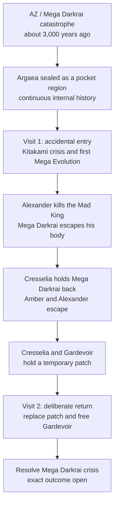

# Argaea

**Status:** drafting

**Arcs:** 10 (Visit 1) and 16 (Visit 2)

Argaea's cross-arc thread is a failed first visit that leaves Cresselia and
Gardevoir holding a temporary seal, followed by a deliberate return to end the
Mega Darkrai crisis.

## Causal Spine

Argaea is a physically and dimensionally sealed region in the ordinary Pokemon
world, large enough for distinct provinces and communities. Its people
experienced continuous history after the seal; Kitakami is one community
within it. Mew and Amber's trace Mew DNA have no role in the barrier.

[Arc 10](../arcs/10-argaea-kitakami/overview.md) owns Visit 1's sequence and
scene-level decisions. [Arc 16](../arcs/16-argaea-return/overview.md) owns the
return. Argaea is not a Mystery Dungeon, alternate universe, Ultra Wormhole, or
universal source of dimensional anomalies.

## Provisional Directions

The Mad King's death leaves a power vacuum while Mega Darkrai remains loose and
feeds Argaea's hatred and instability. A civil war of roughly seven territorial
warlords, with Alexander becoming an internal unifier, is one provisional model;
the war, count, factions, his method, and political outcome remain open.

The Loyal Three may be former guardians corrupted through Mega Darkrai,
Pecharunt, or Toxic Chains. Hoopa may later help navigate an existing
distortion but is not Argaea's cause.

## Open Decisions

- cause and culpability for the original breach;
- the Mad King's corruption and how Mega Darkrai came to inhabit him;
- Visit 1's exact confrontation, escape, and seal mechanics;
- Visit 2's party, repair or replacement mechanism, win condition, and
  political outcome;
- Loyal Three and Pecharunt history and their connection to Mega Darkrai.

Argaea remains the current name. **Ashura Kingdom** is the author's lean, not a
committed rename; see [Vocabulary](../../vocab.md).

## Cross-Refs

- [Prince Alexander](../../reference/characters/humans/prince-alexander.md)
- [Darkrai and Cresselia](../../reference/world/phenomena/legendaries/darkrai-cresselia.md)
- [Mystery Dungeon Instability](mystery-dungeon-instability.md)
