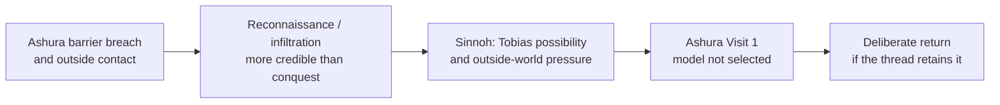

# Ashura

**Status:** drafting

Ashura is a sealed kingdom whose internal succession crisis and first contact with the outside world remain unresolved planning. Its placement after Sinnoh is a direction, not a locked arc slot.

## Current Frame

Ashura is distinct from Mystery Dungeons, Ultra Wormholes, and alternate worlds. The prior universalized causal spine that treated a Mad King's death and a dual-anchor seal as settled has been retired pending a single succession model.

## Live Directions

- An uncle may usurp the throne; Alexander/the heir may vanish; Cresselia may refuse to acknowledge the usurper and disappear.
- The regime may study or try to harness Mega Darkrai, with a barrier breach exposing it to the outside world.
- Tobias may be an early outward-facing scout or representative.
- The Loyal Three are corrupted, but the cause is undecided.

## Open Decisions

The [succession model](../decisions/ashura-visit-one-succession-model.md) owns the explicit contradiction between the legacy Mad-King model and the usurper-before-entry model. It also tracks the open question of whether Mega Darkrai amplifies existing desire.

Until that decision is made, the visit's exact party, access route, antagonists, Cresselia and Gardevoir's roles, seal mechanics, political outcome, and return conditions are open.

## Cross-Refs

- [Succession model](../decisions/ashura-visit-one-succession-model.md)
- [Visit 1](../arcs/10-ashura-kitakami/overview.md)
- [Provisional return](../arcs/16-ashura-return/overview.md)
- [Tobias](../arcs/12-sinnoh/tobias.md)
